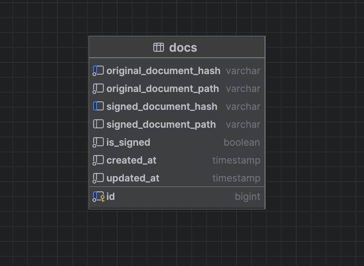

# Doc verify
# 🚀 Document Verify

Document Verify — микросервис для генерации, подписания и верификации PDF-документов, с интеграцией в MinIO и интерфейсом FastAPI.

---

## 📋 Требования

Перед запуском убедитесь, что установлены:

- [Docker](https://www.docker.com/)
- [Docker Compose](https://docs.docker.com/compose/)
- [Taskfile CLI](https://taskfile.dev/#/installation)

---

## ⚙️ Шаги для запуска

1. **Создайте `.env` файл** из шаблона .env.example:

2. **Поднимите проект** (миграции будут проведены автоматически):
```shell
task docker:up
```

## 🔎 Интерфейсы

- 📘 Swagger UI: [http://0.0.0.0:8001/swagger#/](http://0.0.0.0:8001/swagger#/)
- 🗂 MinIO Web: [http://0.0.0.0:9004/](http://0.0.0.0:9004/)
- 📊 Grafana (логи и метрики): [http://localhost:3001/](http://localhost:3001/)

---

## 🧪 (Дополнительно) Локальный запуск

> ⚠️ Не рекомендуется, используется только для ручного применения миграций

**Требуется:**

- Python 3.12  
- [uv](https://github.com/astral-sh/uv)

**Установка зависимостей:**

```bash
uv sync
```


## 🧩 Стек технологий
- Язык и фреймворк: Python 3.12 + FastAPI
- Генерация PDF: --
- База данных: PostgreSQL
- Миграции: Alembic
- Хранилище файлов: MinIO
- Мониторинг и логи: Prometheus + Grafana + Loki
- Управление задачами: Taskfile (taskfile.dev)

## 🗂 Схема базы данных



